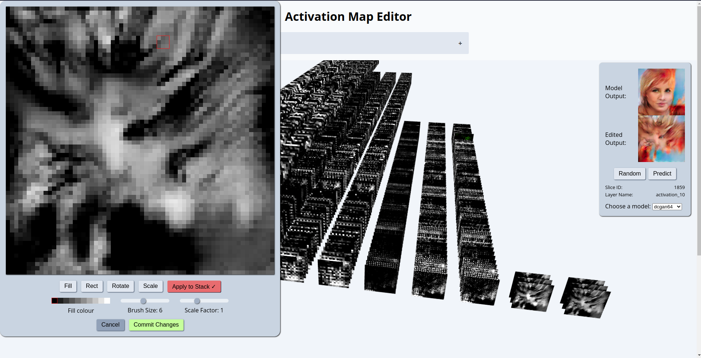

# Activation Map Viewer (and editor)

This is an experiment in developing an interactive version of Terence Broad's [Network Bending](https://github.com/terrybroad/network-bending). This work provides a 3D visualisation of the activation maps of a neural network (in this case CNN's) and allows the user to select a single slice of an activation map or the entire stack and manipulate it using a simple visual editor. The activation map can be drawn on, rotated and scaled and the re-inserted into the network to see the effect on the output.

### [Live demo here](https://gl-activation-map-viewer.vercel.app)

The process is somewhat temperamental so video of the tool in action below:

https://github.com/joshmurr/gl-activation-map-viewer/assets/3018563/a8828dc0-487e-49bf-ac95-d9b9924782f2
